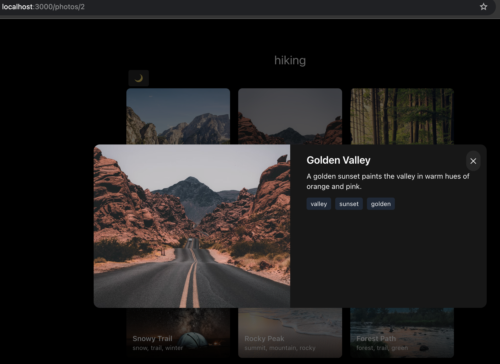

This is a [Next.js](https://nextjs.org) project bootstrapped with [`create-next-app`](https://nextjs.org/docs/app/api-reference/cli/create-next-app).

## Getting Started

First, run the development server:

```bash

# Install dependencies
bun install

# Run development server
bun dev

# Build for production
bun run build

# Start production build
bun start

```

Open [http://localhost:3000](http://localhost:3000) with your browser to see the result.

You can start editing the page by modifying `app/page.tsx`. The page auto-updates as you edit the file.

This project uses [`next/font`](https://nextjs.org/docs/app/building-your-application/optimizing/fonts) to automatically optimize and load [Geist](https://vercel.com/font), a new font family for Vercel.

## Modal routing and state persistence

I use the Next.js App Router with usePathname() to detect when the current URL matches a photo route (like /photos/[id]). When it does, the Modal component renders on top of the gallery — this keeps the gallery state (scroll position, loaded images, etc.) intact. Closing the modal calls router.back() which restores the previous route and state without re-rendering the gallery. If the user navigates directly to /photos/[id], the same content is rendered as a standalone page instead of a modal.

 
